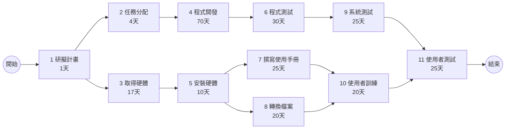
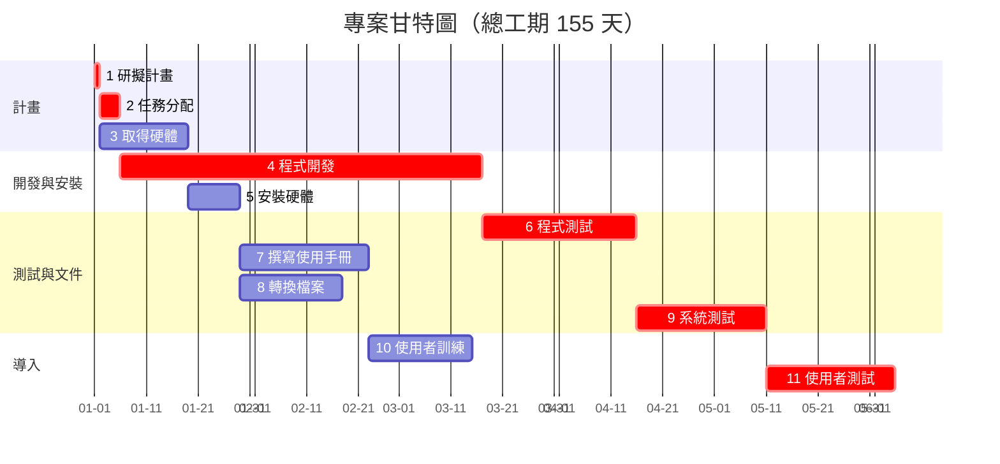

# PERT/CPM、甘特圖與關鍵路徑

## 1. 任務及任務模式

| 任務 | 說明 | 需時(天) | 前置任務 | 任務模式 |
|---|---|---:|---|---|
| 1 | 研擬計畫 | 1 | 0 | Auto |
| 2 | 任務分配 | 4 | 1 | Auto |
| 3 | 取得硬體 | 17 | 1 | Auto |
| 4 | 程式開發 | 70 | 2 | Auto |
| 5 | 安裝硬體 | 10 | 3 | Auto |
| 6 | 程式測試 | 30 | 4 | Auto |
| 7 | 撰寫使用手冊 | 25 | 5 | Auto |
| 8 | 轉換檔案 | 20 | 5 | Auto |
| 9 | 系統測試 | 25 | 6 | Auto |
| 10 | 使用者訓練 | 20 | 7, 8 | Auto |
| 11 | 使用者測試 | 25 | 9, 10 | Auto |

## 2. 開始及結束時間

| 任務 | 開始時間 | 結束時間 |
|---|---:|---:|
| 1 | 0 | 1 |
| 2 | 1 | 5 |
| 3 | 1 | 18 |
| 4 | 5 | 75 |
| 5 | 18 | 28 |
| 6 | 75 | 105 |
| 7 | 28 | 53 |
| 8 | 28 | 48 |
| 9 | 105 | 130 |
| 10 | 53 | 73 |
| 11 | 130 | 155 |

## 3. PERT/CPM 圖

## 4. 甘特圖

## 5. 關鍵路徑

關鍵路徑：
1 → 2 → 4 → 6 → 9 → 11

各任務時間：
1：1 天
2：4 天
4：70 天
6：30 天
9：25 天
11：25 天

專案總工期：
1 + 4 + 70 + 30 + 25 + 25 = 155 天
